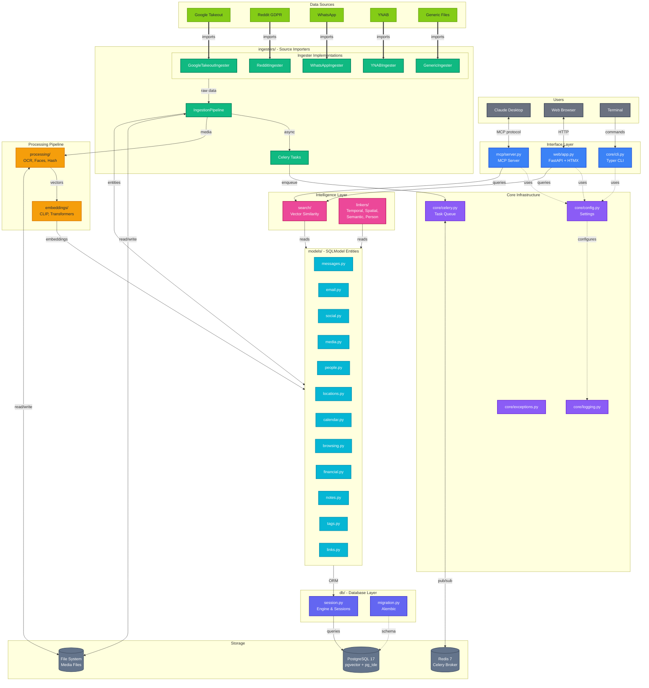

# Potluck - Product Requirements Document

## Executive Summary

Potluck is a privacy-first personal knowledge management system that aggregates data from multiple sources, deduplicates content, creates cross-entity relationships, and exposes your personal data to LLMs via the Model Context Protocol (MCP). All processing happens locally with no external API calls.

## Problem Statement

Users accumulate vast amounts of personal data across different platforms (Google, Reddit, WhatsApp, financial tools, etc.) but have no unified way to:
1. Search across all their data in one place
2. Surface connections between data points (e.g., "photos from the same trip as this email")
3. Use this personal context to personalize AI assistants
4. Maintain privacy while leveraging modern AI capabilities

## Target Users

- Privacy-conscious individuals who want AI personalization without cloud dependency
- Power users with large data archives from Google Takeout and GDPR exports
- Developers and researchers who want to query their personal knowledge base
- Anyone who wants to connect their scattered digital life

## Goals

1. **Privacy First**: All data stays local. No external API calls for embeddings or processing.
2. **Unified Search**: Query across all personal data sources with hybrid text + semantic search.
3. **Relationship Discovery**: Automatically link entities by time, location, people, and semantic similarity.
4. **AI Integration**: Expose personal knowledge to LLMs via MCP for contextual assistance.
5. **Extensibility**: Easy to add new data sources and embedding providers.

## Non-Goals

- Real-time sync with cloud services (batch import only)
- Mobile application
- Multi-user support (single-user system)
- Cloud hosting or SaaS offering

---

## Features

### Data Ingestion

| Source | Data Types |
|--------|------------|
| Google Takeout | Photos, Location History, Chat, Calendar, Gmail, Chrome |
| Reddit GDPR | Posts, Comments, Subscriptions, Saved items |
| WhatsApp | Chat exports with media |
| YNAB | Transactions, Accounts, Budgets |
| Generic | Image folders, Text/Markdown files, MBOX email archives |

**Capabilities:**
- Two-level auto-detection (detect export type, then detect contents within)
- Archive extraction (ZIP, TAR, etc.)
- File-level deduplication via SHA256 hashing
- Entity-level deduplication via content hashing
- Import source tracking with statistics
- Progress tracking for long imports
- Background processing via Celery task queue

### Entity Models (Source-Agnostic)

All entities are generic and not tied to a specific source. A `source_type` field tracks origin.

| Entity | Description |
|--------|-------------|
| Person | Aggregated identity across sources (names, emails, phones, face encodings) |
| ChatMessage | Messages from any platform (WhatsApp, Telegram, SMS, etc.) |
| Media | Photos, videos, audio, documents with extracted metadata and embeddings |
| Email | Email messages with threads and attachments |
| SocialPost | Posts from Reddit, Twitter, etc. |
| SocialComment | Comments on social posts (Reddit, YouTube, etc.) |
| BrowsingHistory | Browser history entries |
| Bookmark | Saved bookmarks with folder organization |
| KnowledgeNote | User-created notes and annotations |
| Location | Named places with coordinates |
| LocationVisit | Visit instances at specific locations |
| CalendarEvent | Calendar events with participants |
| Transaction | Financial transactions and accounts |

### Media Processing

- **Hashing**: SHA256 for content dedup + perceptual hashing (pHash) for visual similarity
- **OCR**: Text extraction from images using EasyOCR
- **Face Detection**: Face encoding using DeepFace library (FaceNet backend, 128-d vectors) with auto-clustering via DBSCAN
- **Face Clustering**: Google Photos-style auto-clustering of detected faces into groups, with user review UI for person assignment
- **EXIF Extraction**: Location, timestamp, camera info from photo metadata
- **Image Captioning**: AI-generated image descriptions (alt-text) using BLIP-2 model
- **Embeddings**: CLIP multimodal embeddings for image+text similarity

### Search

**Hybrid Search** combining:
- pgvector similarity search with HNSW indexes
- Reciprocal Rank Fusion (RRF) with configurable weights

### Entity Linking

Automatic relationship detection between entities:

| Linker | Description |
|--------|-------------|
| Temporal | Entities from same time period |
| Spatial | Entities near same geographic location |
| Semantic | Entities with similar embedding vectors |
| Person | Entities involving the same person (faces, names, contact info) |
| Entity | Named entity linking (places, organizations) |

### Tagging System

Flexible tagging for organizing any entity type:
- User-defined tags with categories
- Tag assignments to any entity type
- Support for "lambda tags" (unnamed quick annotations)

### MCP Server

Expose knowledge to LLMs via stdio transport for Claude Desktop integration.

**Tools:**
- `search_knowledge` - Hybrid search across all entities
- `get_entity` - Retrieve full entity details by type and ID
- `create_note` - Create a new knowledge note with tags
- `find_related` - Find entities linked by temporal/spatial/semantic relationships
- `timeline_view` - Get chronological events in a date range
- `search_by_location` - Find entities near geographic coordinates
- `search_by_person` - Find all entities related to a person
- `get_statistics` - Overview of knowledge base contents

**Resources:**
- `potluck://notes/{id}` - Access notes
- `potluck://media/{id}` - Access media metadata
- `potluck://conversations/{id}` - Access chat threads
- `potluck://timeline/{date}` - Access timeline data

### Web Interface

FastAPI + HTMX server-side rendered interface.

**Pages:**
- Dashboard with statistics
- Search with hybrid results
- Media gallery with filtering
- Notes management
- People/contacts view
- Timeline view
- Data sources documentation
- Settings and import history
- File upload with progress tracking

---

## Technical Architecture

### Tech Stack

| Component | Technology |
|-----------|------------|
| Language | Python 3.12+ |
| Web Framework | FastAPI + HTMX + Jinja2 |
| ORM | SQLModel + Alembic migrations |
| Database | Percona PostgreSQL 17 with pgvector + pg_tde |
| Task Queue | Celery + Redis |
| Text Embeddings | sentence-transformers (configurable) |
| Multimodal Embeddings | CLIP |
| OCR | EasyOCR |
| Face Recognition | DeepFace (FaceNet backend) |
| Image Captioning | BLIP-2 (transformers) |
| MCP Protocol | mcp library |
| Data Processing | Polars |
| Package Manager | uv |
| Containerization | Docker Compose |

### Database Design

- **Encrypted at rest** using pg_tde from day one
- **pgvector** for vector similarity with HNSW indexes
- **Multiple embeddings per entity** stored in separate tables

### Deployment

```
┌───────────────────────────────────────────────┐
│            docker-compose.yml                  │
├───────────────┬───────────────┬───────────────┤
│  potluck-app  │  potluck-db   │ potluck-redis │
│  (Python 3.12)│  (Percona     │ (Redis 7      │
│               │   PG 17)      │  Alpine)      │
├───────────────┼───────────────┼───────────────┤
│ Port: 8000    │ Port: 5432    │ Internal only │
│ (configurable)│ (configurable)│ (not exposed) │
├───────────────┼───────────────┼───────────────┤
│ Volumes: none │ Volumes:      │ Volumes:      │
│               │ potluck-pgdata│ potluck-redis │
└───────────────┴───────────────┴───────────────┘
```

**Installation Methods:**

| Method | Audience | Command |
|--------|----------|---------|
| One-liner install | End-users | `curl ... \| bash` downloads pre-built images from GHCR |
| Development setup | Contributors | `./scripts/setup.sh` builds locally |

**Docker Images (GHCR):**

- `ghcr.io/doublegremlin181/potluck:latest` - Application image (CPU-only, ~1.5GB)
- `ghcr.io/doublegremlin181/potluck-db:latest` - Database image (Percona PG17)
- Images are built and pushed automatically on tagged releases

**GPU Support:**

- Optional CUDA support available via `--gpu` flag
- GPU builds use CUDA 12.4 PyTorch (~4.5GB image)
- Requires NVIDIA GPU + nvidia-container-toolkit

**Key Components:**

- Single `potluck` command with subcommands: `mcp`, `web`
- Alembic migrations run automatically on container start
- Configuration via `.env` file (ports, credentials, GPU mode)
- Health checks on all services for reliable startup ordering
- Redis for Celery task queue (internal network only)

---

## Success Metrics

1. **Import Coverage**: Support for major Google Takeout data types
2. **Search Quality**: Relevant results in top 5 for 80%+ of queries
3. **Performance**: Search response < 500ms for databases up to 1M entities
4. **Reliability**: Zero data loss during import/processing

---

## Security Considerations

- All data stored locally, never transmitted externally
- Database encryption via pg_tde
- No telemetry or analytics
- No external embedding APIs (all local models)
- File uploads validated and sanitized

---

## Future Considerations (Out of Scope for v1)

- Additional data sources (Apple, Microsoft, Spotify, etc.)
- Browser extension for real-time capture
- Natural language query interface
- Export functionality
- Backup and restore
- Multi-language support for OCR

---

## Appendix: Folder Structure

```
potluck/
├── src/potluck/
│   ├── core/          # Config, logging, Celery, CLI, exceptions
│   ├── models/        # SQLModel entities
│   ├── ingesters/     # Source-specific importers with pipeline
│   ├── embeddings/    # Embedding providers
│   ├── processing/    # OCR, hashing, face detection
│   ├── search/        # Hybrid search implementation
│   ├── linkers/       # Entity relationship detection
│   ├── mcp/           # MCP server and tools
│   ├── web/           # FastAPI + HTMX web UI
│   └── db/            # Database session and migration management
├── alembic/           # Database migrations
├── tests/             # Unit and integration tests
├── docker/            # Docker configuration files
└── scripts/           # Utility scripts
```

## Appendix: Architecture Diagram


