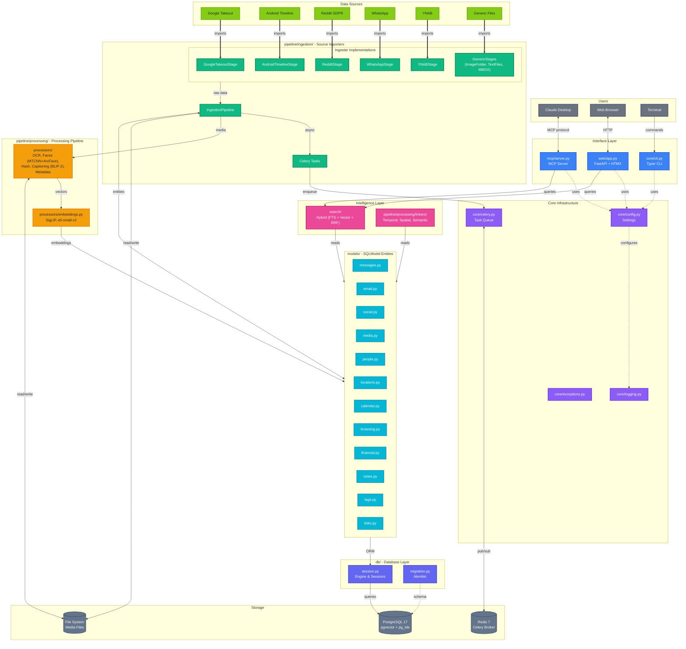

# Potluck - Product Requirements Document

## Executive Summary

Potluck is a privacy-first personal knowledge management system that aggregates data from multiple sources, deduplicates content, creates cross-entity relationships, and exposes your personal data to LLMs via the Model Context Protocol (MCP). All processing happens locally with no external API calls.

## Problem Statement

Users accumulate vast amounts of personal data across different platforms (Google, Reddit, WhatsApp, financial tools, etc.) but have no unified way to:
1. Search across all their data in one place
2. Surface connections between data points (e.g., "photos from the same trip as this email")
3. Use this personal context to personalize AI assistants
4. Maintain privacy while leveraging modern AI capabilities

## Target Users

- Privacy-conscious individuals who want AI personalization without cloud dependency
- Power users with large data archives from Google Takeout and GDPR exports
- Developers and researchers who want to query their personal knowledge base
- Anyone who wants to connect their scattered digital life

## Goals

1. **Privacy First**: All data stays local. No external API calls for embeddings or processing.
2. **Unified Search**: Query across all personal data sources with hybrid text + semantic search.
3. **Relationship Discovery**: Automatically link entities by time, location, people, and semantic similarity.
4. **AI Integration**: Expose personal knowledge to LLMs via MCP for contextual assistance.
5. **Extensibility**: Easy to add new data sources and embedding providers.

## Non-Goals

- Real-time sync with cloud services (batch import only)
- Mobile application
- Multi-user support (single-user system)
- Cloud hosting or SaaS offering

---

## Features

### Data Ingestion

| Source | Data Types |
|--------|------------|
| Google Takeout | Photos, Gmail, Calendar, Chat, Chrome (bookmarks, browsing history), Location History, Google Keep (notes) |
| Android Timeline | Location history (Timeline.json) |
| Reddit GDPR | Posts, Comments, Subscriptions, Saved items |
| WhatsApp | Chat exports with media |
| YNAB | Transactions, Budgets |
| Generic | Image folders, Text/Markdown files, MBOX email archives |

**Capabilities:**
- Two-level auto-detection (detect export type, then detect contents within)
- Archive extraction (ZIP, TAR, etc.)
- File-level deduplication via SHA256 hashing
- Entity-level deduplication via content hashing
- Import source tracking with statistics
- Progress tracking for long imports
- Background processing via Celery task queue

### Entity Models (Source-Agnostic)

All entities are generic and not tied to a specific source. A `source_type` field tracks origin.

| Entity | Description |
|--------|-------------|
| Person | Aggregated identity across sources (names, emails, phones, face encodings) |
| ChatMessage | Messages from any platform (WhatsApp, Google Chat, SMS, etc.) |
| Media | Photos, videos, audio, documents with extracted metadata and embeddings |
| Email | Email messages with threads and attachments |
| Document | Ingested documents and notes from external sources (e.g., Google Keep) |
| SocialPost | Posts from Reddit, Twitter, etc. |
| SocialComment | Comments on social posts (Reddit, YouTube, etc.) |
| SocialFollow | Subscriptions/follows (e.g., subreddit subscriptions) |
| BrowsingHistory | Browser history entries |
| Bookmark | Saved bookmarks with folder organization |
| KnowledgeNote | User-created notes and annotations within Potluck |
| Location | Named places with coordinates |
| LocationVisit | Visit instances at specific locations |
| CalendarEvent | Calendar events with participants |
| Transaction | Financial transactions |
| Budget | Budget categories and allocations (e.g., YNAB budgets) |
| Tag | User-defined tags for organizing any entity type |

### Media Processing

- **Hashing**: SHA256 for content dedup + perceptual hashing (pHash) for visual similarity
- **OCR**: Text extraction from images using EasyOCR
- **Face Detection**: MTCNN for face detection (returns 160x160 crops, resized to 112x112 for recognition), ArcFace IResNet50 for 512-d face embeddings (vendored implementation, no DeepFace dependency), with auto-clustering via DBSCAN
- **Face Clustering**: Google Photos-style auto-clustering of detected faces into groups, with user review UI for person assignment
- **EXIF Extraction**: Location, timestamp, camera info from photo metadata
- **Image Captioning**: AI-generated image descriptions (alt-text) using BLIP-2 (`Salesforce/blip2-opt-2.7b`)
- **Embeddings**: SigLIP (`google/siglip-base-patch16-224`, 768-d) multimodal embeddings for cross-modal image+text search; e5-small-v2 (`intfloat/e5-small-v2`, 384-d) text embeddings for text-to-text semantic search; additional per-media OCR and caption text embeddings

**Processor Priority Order** (executed sequentially by priority):

| Priority | Processor | Description |
|----------|-----------|-------------|
| 10 | Hashing | SHA256 content hash + perceptual hash (pHash) |
| 20 | Metadata | EXIF extraction (location, timestamp, camera info) |
| 25 | Text Embedding | e5-small-v2 text-only embeddings (384-d) for text entities |
| 26 | Multimodal Text Embedding | SigLIP text embeddings (768-d) for cross-modal search |
| 28 | Media Embedding | SigLIP visual embeddings + OCR/caption text embeddings |
| 30 | OCR | EasyOCR text extraction from images |
| 40 | Faces | MTCNN detection + ArcFace IResNet50 embedding (512-d) |
| 50 | Captioning | BLIP-2 image captioning |

### Search

**Hybrid Search** combining two complementary approaches:

| Method | Column | What it Finds | Example |
|--------|--------|---------------|---------|
| Full-Text Search (FTS) | `search_vector` (TSVECTOR) | Keyword matches with stemming | "running" → "run", "runs" |
| Vector Similarity (text) | `embedding` (384d, e5-small-v2) | Semantically similar text content | "car" → "automobile", "vehicle" |
| Vector Similarity (multimodal) | `multimodal_embedding` (768d, SigLIP) | Cross-modal text-to-image search | "sunset over ocean" → matching photos |

- **FTS**: Uses `websearch_to_tsquery` for Google-like search syntax and `ts_rank_cd` (cover density ranking) for scoring. GIN indexes on TSVECTOR columns, auto-populated by triggers.
- **Embeddings**: Dense vectors encoding meaning (e5-small-v2 for text, SigLIP for cross-modal image search). pgvector HNSW indexes with cosine distance.
- **Reciprocal Rank Fusion (RRF)**: Blends ranked results from both methods with configurable weights (default: FTS 0.3, Vector 0.7, k=60).
- **Caching**: In-memory LRU cache with TTL-based expiration for search results.

Search modes: FTS-only, vector-only (text or multimodal), or hybrid (default).

### Entity Linking

Automatic relationship detection between entities. Linker implementations live under `pipeline/processing/linkers/` (the top-level `linkers/` module is a reserved empty placeholder for future use).

| Linker | Description | Status |
|--------|-------------|--------|
| Temporal | Creates SAME_TIME links for entities occurring close in time | Implemented |
| Spatial | Creates SAME_LOCATION and NEAR links based on coordinates | Implemented |
| Semantic | Creates SIMILAR links based on embedding similarity | Implemented |
| Person | Entities involving the same person (faces, names, contact info) | Not yet implemented |
| Entity | Named entity linking (places, organizations) | Not yet implemented |

### Tagging System

Flexible tagging for organizing any entity type:
- User-defined tags with categories
- Tag assignments to any entity type
- Support for "lambda tags" (unnamed quick annotations)

### MCP Server

**Status: Planned but not yet implemented.** The `mcp/server.py` module exists as a stub that raises `NotImplementedError`. The design below represents the intended feature set.

Expose knowledge to LLMs via stdio transport for Claude Desktop integration.

**Tools:**
- `search_knowledge` - Hybrid search across all entities
- `get_entity` - Retrieve full entity details by type and ID
- `create_note` - Create a new knowledge note with tags
- `find_related` - Find entities linked by temporal/spatial/semantic relationships
- `timeline_view` - Get chronological events in a date range
- `search_by_location` - Find entities near geographic coordinates
- `search_by_person` - Find all entities related to a person
- `get_statistics` - Overview of knowledge base contents

**Resources:**
- `potluck://notes/{id}` - Access notes
- `potluck://media/{id}` - Access media metadata
- `potluck://conversations/{id}` - Access chat threads
- `potluck://timeline/{date}` - Access timeline data

### Web Interface

Server-side rendered interface using FastAPI + HTMX + Jinja2 with Tailwind CSS + DaisyUI for styling. No JavaScript build step required — all JS libraries are vendored or loaded via CDN.

**Design:**
- Custom DaisyUI themes (light: warm cream/amber, dark: charcoal/amber) using oklch color space
- Typography: Fraunces (serif, headings) + DM Sans (body text)
- Responsive layout with mobile hamburger menu
- Sticky navbar with backdrop blur, light/dark theme toggle
- HTMX-powered partial page updates (fragments detected via `HX-Request` header)
- Real-time import progress via SSE (Server-Sent Events) with notification bell dropdown

**Authentication:**
- Optional password protection via `WEB_PASSWORD` env var (no auth by default)
- Session tokens via signed cookies (`itsdangerous` library, 30-day expiry)
- Middleware skips auth for `/login`, `/static`, `/favicon.ico`

**Pages:**

| Page | Description |
|------|-------------|
| Dashboard | Entity count cards, recent activity feed, active import status |
| Search | Hybrid/FTS/vector mode selector, entity type filters, HTMX result loading |
| Media Gallery | Responsive grid, type/OCR/caption filters, lightbox detail view, pagination |
| Notes | Full CRUD for knowledge notes with create/edit/delete |
| People | Paginated list, detail view with aliases and linked entities, merge UI |
| Timeline | vis-timeline.js interactive timeline with date range and type filters |
| Map | Leaflet.js map with clustered markers, viewport-based loading, type filters |
| Imports | File upload, server-side file browser, cancel in-progress, import history |
| Settings | Database statistics, configuration display |
| Login | Simple password form (only shown when `WEB_PASSWORD` is set) |

**Reusable Components:**
- `entity_card.html` — Jinja2 macros for rendering entity summaries across pages
- `pagination.html` — Shared pagination controls
- HTMX partials: `search_results`, `media_grid`, `media_detail`, `progress_dropdown`

**Static Assets (vendored, no CDN for JS):**
- HTMX 2.0.4 + SSE extension
- vis-timeline 7.7.3 (+ CSS)
- Leaflet 1.9.4 (+ CSS)
- Theme toggle script (prevents flash on load)

---

## Technical Architecture

### Tech Stack

| Component | Technology |
|-----------|------------|
| Language | Python 3.12+ |
| Web Framework | FastAPI + HTMX 2.0 + Jinja2 |
| Web Styling | Tailwind CSS 3.4 + DaisyUI 4 (CDN, no build step) |
| ORM | SQLModel + Alembic migrations |
| Database | Percona PostgreSQL 17 with pgvector + pg_tde |
| Task Queue | Celery + Redis |
| Text Embeddings | sentence-transformers (configurable) |
| Multimodal Embeddings | SigLIP (`google/siglip-base-patch16-224`) |
| OCR | EasyOCR |
| Face Detection | MTCNN (`facenet-pytorch`) |
| Face Recognition | ArcFace IResNet50 (vendored, 512-d embeddings) |
| Image Captioning | BLIP-2 (transformers) |
| Web Auth | itsdangerous (signed session cookies) |
| Interactive Maps | Leaflet.js 1.9 (vendored) |
| Timeline Visualization | vis-timeline 7.7 (vendored) |
| MCP Protocol | mcp library |
| Data Processing | Polars |
| Package Manager | uv |
| Containerization | Docker Compose |

### Database Design

- **Percona PostgreSQL 17** (not standard PostgreSQL) with **pg_tde** for transparent data encryption at rest
- **pgvector** for vector similarity with **17 HNSW indexes** (cosine distance) and **11 GIN indexes** (for FTS TSVECTOR columns)
- **22 TSVECTOR triggers** auto-populating search vectors on insert/update
- **41 tables** total across all entity types, embeddings, relationships, and metadata
- **Multiple embeddings per entity** stored in separate tables (e.g., `media_embedding` for SigLIP/OCR/caption embeddings per media item)

### Deployment

```
┌───────────────────────────────────────────────┐
│            docker-compose.yml                  │
├───────────────┬───────────────┬───────────────┤
│  potluck-app  │  potluck-db   │ potluck-redis │
│  (Python 3.12)│  (Percona     │ (Redis 7      │
│               │   PG 17)      │  Alpine)      │
├───────────────┼───────────────┼───────────────┤
│ Port: 8000    │ Port: 5432    │ Internal only │
│ (configurable)│ (configurable)│ (not exposed) │
├───────────────┼───────────────┼───────────────┤
│ Volumes: none │ Volumes:      │ Volumes:      │
│               │ potluck-pgdata│ potluck-redis │
└───────────────┴───────────────┴───────────────┘
```

**Installation Methods:**

| Method | Audience | Command |
|--------|----------|---------|
| One-liner install | End-users | `curl ... \| bash` downloads pre-built images from GHCR |
| Development setup | Contributors | `./scripts/setup.sh` builds locally |

**Docker Images (GHCR):**

- `ghcr.io/doublegremlin181/potluck:latest` - Application image (CPU-only, ~1.5GB)
- `ghcr.io/doublegremlin181/potluck:gpu` - Application image (GPU/CUDA 12.4, ~4.5GB)
- `ghcr.io/doublegremlin181/potluck-db:latest` - Database image (Percona PG17)
- Images are built and pushed automatically on tagged releases

**GPU Support:**

- Optional CUDA support available via `--gpu` flag (uses pre-built GPU image from GHCR)
- GPU image uses CUDA 12.4 PyTorch (~4.5GB)
- Requires NVIDIA GPU + nvidia-container-toolkit

**Key Components:**

- Single `potluck` command with subcommands: `mcp`, `web`
- Alembic migrations run automatically on container start
- Configuration via `.env` file (ports, credentials, GPU mode)
- Health checks on all services for reliable startup ordering
- Redis for Celery task queue (internal network only)

---

## Success Metrics

1. **Import Coverage**: Support for major Google Takeout data types
2. **Search Quality**: Relevant results in top 5 for 80%+ of queries
3. **Performance**: Search response < 500ms for databases up to 1M entities
4. **Reliability**: Zero data loss during import/processing

---

## Security Considerations

- All data stored locally, never transmitted externally
- Database encryption via pg_tde
- No telemetry or analytics
- No external embedding APIs (all local models)
- File uploads validated and sanitized
- Web UI: optional password auth with signed session cookies (no auth by default)
- Media files served by ID lookup only — no filesystem paths exposed to browser

---

## Future Considerations (Out of Scope for v1)

- Additional data sources (Apple, Microsoft, Spotify, etc.)
- Browser extension for real-time capture
- Natural language query interface
- Export functionality
- Backup and restore
- Multi-language support for OCR

---

## Appendix: Folder Structure

```
potluck/
├── src/potluck/
│   ├── core/              # Config, logging, Celery, CLI, exceptions, constants
│   ├── models/            # SQLModel entities
│   ├── pipeline/          # Unified ingestion and processing pipeline
│   │   ├── ingestion/     # Source-specific importers (Google Takeout, Reddit, WhatsApp, etc.)
│   │   ├── processing/    # Media processors (OCR, hashing, faces, captioning, embeddings)
│   │   │   ├── processors/  # Individual processor implementations
│   │   │   ├── _arcface/    # Vendored ArcFace face recognition
│   │   │   ├── linkers/     # Entity relationship linkers (temporal, spatial, semantic)
│   │   │   └── core/        # Base infrastructure, registry, ML model loading
│   │   ├── tasks/         # Celery task orchestration
│   │   └── utils/         # Archive extraction, hashing, parsers
│   ├── search/            # Hybrid search implementation (FTS + vector + RRF)
│   ├── linkers/           # Reserved placeholder (actual linkers in pipeline/processing/linkers/)
│   ├── mcp/               # MCP server stub (not yet implemented)
│   ├── web/               # FastAPI + HTMX web UI
│   └── db/                # Database session and migration management
├── alembic/               # Database migrations
├── tests/                 # Unit and integration tests
├── docker/                # Docker configuration files
└── scripts/               # Utility scripts
```

## Appendix: Architecture Diagram


